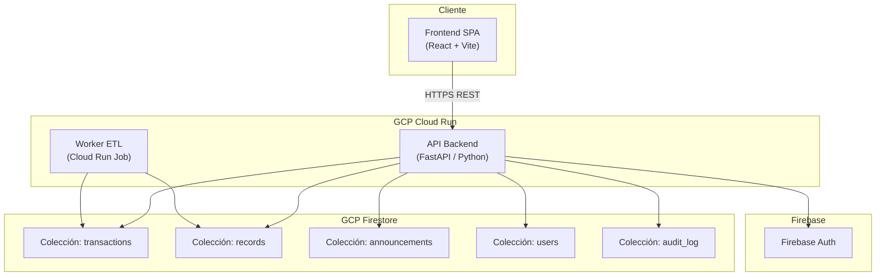

# Diseño Técnico: Plataforma Académica PRETSO

## Visión General

PRETSO es una plataforma académica digital para el estudio del teatro hispanoamericano de los siglos XVI–XVII. El sistema centraliza un corpus histórico de ~7 tablas CSV (≈ miles de registros) y lo expone a través de dos módulos diferenciados:

- **Portal Público**: consulta abierta, búsqueda semántica, API REST de solo lectura, tablón de anuncios y pre-registro académico.
- **Panel Privado**: gestión CRUD del corpus, flujo de publicación por estados, ETL desde CSV y administración de usuarios con RBAC.

La infraestructura se despliega íntegramente sobre **GCP Free Tier**: Cloud Run (escala a cero), Firestore (modo nativo) y Firebase Authentication. La búsqueda semántica se implementa con embeddings almacenados en Firestore como vectores, usando la API de embeddings de Vertex AI (cuota gratuita) o un modelo open-source ligero en el propio contenedor.

### Restricciones de diseño

| Restricción | Decisión |
|---|---|
| Infraestructura | GCP Free Tier únicamente |
| Base de datos | Firestore modo nativo (≤ 1 GB) |
| Cómputo | Cloud Run, escala a cero |
| Autenticación | Firebase Auth + RBAC custom claims |
| Búsqueda semántica | Embeddings en Firestore + similitud coseno en backend |
| i18n | `react-i18next` (frontend) / mensajes de API en español e inglés |
| Umbral de lanzamiento | 20 Registros_Maestros publicados |

---

## Arquitectura

### Diagrama de alto nivel



### Decisiones de arquitectura

**Backend: FastAPI (Python)**
FastAPI ofrece generación automática de OpenAPI 3.0, tipado con Pydantic, y rendimiento adecuado para el volumen de datos esperado. El contenedor Cloud Run arranca en < 2 s en frío.

**Frontend: React + Vite + react-i18next**
SPA desplegada como assets estáticos en Firebase Hosting (gratuito). Se comunica con el backend vía REST. El cambio de idioma es en memoria, sin recarga de datos.

**Base de datos: Firestore modo nativo**
Modelo documental adecuado para el esquema centrado en Transacción. Consultas compuestas con índices. Los embeddings se almacenan como arrays de floats en el documento del registro. Límite gratuito: 1 GB almacenamiento, 50k lecturas/día, 20k escrituras/día.

**Búsqueda semántica: embeddings en Firestore**
Se generan embeddings con `sentence-transformers/paraphrase-multilingual-MiniLM-L12-v2` (modelo open-source, ~120 MB, cargado en el contenedor). La similitud coseno se calcula en el backend sobre los top-N candidatos recuperados por filtros previos. Esto evita costes de Vertex AI y funciona dentro del Free Tier.

**ETL: Cloud Run Job**
Proceso batch disparado manualmente desde el Panel Privado. Lee CSV, valida, transforma y escribe en Firestore. Idempotente por `Indicador_de_Registro`.

---

## Componentes e Interfaces

### Backend (FastAPI)

```
src/
  api/
    public/
      search.py        # GET /api/v1/search
      records.py       # GET /api/v1/records, /records/{id}
      transactions.py  # GET /api/v1/transactions/{id}
      companies.py     # GET /api/v1/companies
      announcements.py # GET /api/v1/announcements
    private/
      records.py       # POST/PUT/DELETE /api/v1/admin/records
      etl.py           # POST /api/v1/admin/etl/run
      users.py         # GET/POST/PUT /api/v1/admin/users
      announcements.py # POST/PUT/DELETE /api/v1/admin/announcements
    auth.py            # Middleware Firebase JWT verification
  services/
    search_service.py  # Lógica de búsqueda semántica
    etl_service.py     # Lógica ETL
    embedding_service.py # Generación de embeddings
    launch_rule.py     # Regla de Lanzamiento Cero
  models/
    record.py          # Pydantic models
    transaction.py
    user.py
  db/
    firestore.py       # Cliente Firestore
```

### Frontend (React)

```
src/
  pages/
    public/
      Home.tsx         # Página de presentación / corpus
      Search.tsx       # Motor de búsqueda
      CompanyDetail.tsx
      TransactionDetail.tsx
      Announcements.tsx
      ApiDocs.tsx
    private/
      Dashboard.tsx
      RecordEditor.tsx
      EtlUpload.tsx
      UserManagement.tsx
  components/
    LanguageSwitcher.tsx
    LaunchProgress.tsx
    SearchFilters.tsx
  i18n/
    es.json
    en.json
```

### Endpoints públicos (API REST)

| Método | Ruta | Descripción |
|---|---|---|
| GET | `/api/v1/records` | Listado paginado de registros publicados |
| GET | `/api/v1/records/{id}` | Detalle de un registro |
| GET | `/api/v1/transactions/{id}` | Transacción con todos sus registros vinculados |
| GET | `/api/v1/companies` | Índice de compañías |
| GET | `/api/v1/companies/{id}` | Detalle de compañía con transacciones |
| GET | `/api/v1/search` | Búsqueda semántica con filtros |
| GET | `/api/v1/announcements` | Tablón de anuncios |
| GET | `/api/v1/openapi.json` | Especificación OpenAPI 3.0 |

**Parámetros de búsqueda (`/api/v1/search`):**
- `q` (texto libre)
- `city` (Toledo | Sevilla | Badajoz | Madrid | Valladolid | Ciudad de México)
- `year_from`, `year_to` (1575–1608)
- `source_table` (CM | CS | CC | IdI | I | Com | B)
- `company`
- `page`, `page_size` (máx. 100)

### Middleware de autenticación

Todos los endpoints `/api/v1/admin/*` requieren un JWT de Firebase en el header `Authorization: Bearer <token>`. El middleware verifica la firma con la clave pública de Firebase y extrae el `custom_claim` de rol (`editor` | `revisor` | `administrador`).

---

## Modelos de Datos

### Colección `transactions` (Firestore)

```json
{
  "id": "Tra-42",
  "created_at": "2024-01-15T10:30:00Z",
  "updated_at": "2024-01-15T10:30:00Z",
  "record_ids": ["CM-12", "CS-7", "CC-3"]
}
```

### Colección `records` (Firestore)

```json
{
  "id": "CM-12",
  "transaction_id": "Tra-42",
  "source_table": "CM",
  "status": "published",
  "city": "Toledo",
  "year": 1592,
  "noticia": "Pago de 8000 reales a la compañía de...",
  "concepto": "Pago por representación",
  "documento_codigo": "Doc. 15",
  "transcripcion": "...",
  "fuente_bibliografica": "San Román, 1935",
  "monto_reales": 8000,
  "monto_maravedis": null,
  "compania_id": "Com-3",
  "embedding": [0.023, -0.145, ...],
  "created_by": "uid_firebase",
  "created_at": "2024-01-15T10:30:00Z",
  "updated_at": "2024-01-15T10:30:00Z",
  "published_at": "2024-01-16T09:00:00Z",
  "rejection_comment": null
}
```

**Campos adicionales por tabla de origen:**

| Tabla | Campos específicos |
|---|---|
| `CM` (Compañías caja) | `tipo_pago`, `concepto_caja` |
| `CS` (Compañías salarios) | `nombre_actor`, `cargo`, `salario_diario` |
| `CC` (Corpus Christi) | `festividad`, `numero_autos` |
| `IdI` (Identificación indicadores) | `tipo_indicador` |
| `I` (Indicadores) | `valor_indicador`, `unidad` |
| `Com` (Índice compañías) | `siglas`, `autor_principal`, `ambito` |
| `B` (Bibliografía) | `autor_bib`, `titulo`, `anio_publicacion`, `editorial` |

### Colección `companies` (Firestore)

```json
{
  "id": "Com-3",
  "siglas": "AGR",
  "autor_principal": "Antonio Granados",
  "temporadas": ["1590-1592", "1595-1597"],
  "ambito": "España",
  "transaction_ids": ["Tra-42", "Tra-55"]
}
```

### Colección `announcements` (Firestore)

```json
{
  "id": "ann-001",
  "title": "Nuevo artículo sobre Ganassa",
  "body": "...",
  "category": "articulo",
  "published_at": "2024-06-01T12:00:00Z",
  "created_by": "uid_firebase"
}
```

### Colección `users` (Firestore)

```json
{
  "uid": "firebase_uid",
  "email": "investigador@universidad.edu",
  "name": "María García",
  "institution": "Universidad Complutense",
  "role": "editor",
  "panel_access": true,
  "search_history": [],
  "favorites": [],
  "created_at": "2024-01-10T08:00:00Z",
  "email_verified": true
}
```

### Colección `audit_log` (Firestore)

```json
{
  "id": "log-001",
  "record_id": "CM-12",
  "user_uid": "firebase_uid",
  "action": "status_change",
  "timestamp": "2024-01-16T09:00:00Z",
  "details": {"from": "en_revision", "to": "publicado"}
}
```

### Esquema JSON de serialización (Requisito 14)

El esquema canónico de serialización de un `Registro_Maestro` es el documento Firestore completo serializado a JSON, con los siguientes campos obligatorios:

```json
{
  "$schema": "pretso-record-v1",
  "id": "string (CM-N | CS-N | CC-N | IdI-N | I-N | Com-N | B-N)",
  "transaction_id": "string (Tra-N)",
  "source_table": "string (CM|CS|CC|IdI|I|Com|B)",
  "status": "string (borrador|en_revision|publicado)",
  "city": "string",
  "year": "integer",
  "noticia": "string",
  "fuente_bibliografica": "string",
  "created_at": "string (ISO 8601)",
  "updated_at": "string (ISO 8601)"
}
```

Los campos opcionales y específicos de tabla se documentan en el OpenAPI. La deserialización valida contra este esquema con Pydantic; cualquier campo obligatorio ausente o tipo incorrecto produce un error descriptivo con el nombre del campo.

### Regla de Lanzamiento Cero

El sistema mantiene un contador en Firestore (`/config/launch_rule`) con el campo `published_count`. Cada vez que un registro cambia a estado `publicado` o es eliminado, una Cloud Function (o lógica en el backend) actualiza este contador. El Portal Público consulta este valor en cada request y decide si mostrar el corpus completo o solo la página de presentación + tablón.

```json
{
  "published_count": 17,
  "threshold": 20,
  "portal_active": false
}
```

---

## Propiedades de Corrección


*Una propiedad es una característica o comportamiento que debe mantenerse verdadero en todas las ejecuciones válidas del sistema — esencialmente, una declaración formal sobre lo que el sistema debe hacer. Las propiedades sirven como puente entre las especificaciones legibles por humanos y las garantías de corrección verificables por máquina.*

**Reflexión de redundancias antes de listar propiedades:**
- Req 1.1 y 1.4 son redundantes (ambas expresan la invariante de integridad referencial). Se consolidan en Propiedad 1.
- Req 5.1 y 5.2 son la misma propiedad de umbral vista desde ambos lados. Se consolidan en Propiedad 6.
- Req 1.2 y 1.3 se consolidan en Propiedad 2 (completitud de referencias cruzadas).

---

### Propiedad 1: Invariante de vinculación Registro–Transacción

*Para cualquier* Registro_Maestro almacenado en la Plataforma, el campo `transaction_id` SHALL ser no nulo y SHALL cumplir el patrón `Tra-\d+`, y SHALL existir una Transacción con ese identificador en la colección `transactions`.

**Valida: Requisitos 1.1, 1.4**

---

### Propiedad 2: Completitud de referencias cruzadas

*Para cualquier* Transacción con un conjunto de `record_ids`, cada identificador en ese conjunto SHALL corresponder a un Registro_Maestro cuyo `transaction_id` apunta de vuelta a esa Transacción (bidireccionalidad). Y para cualquier consulta a `/api/v1/transactions/{id}`, la respuesta SHALL contener exactamente los registros cuyo `transaction_id` es ese identificador.

**Valida: Requisitos 1.2, 1.3**

---

### Propiedad 3: ETL produce registros en estado Borrador

*Para cualquier* archivo CSV válido con N filas que cumplan el esquema de su tabla de origen, la ejecución del proceso ETL SHALL crear exactamente N Registros_Maestros en estado `borrador`, cada uno con `transaction_id` derivado del campo `Transacción` de la fila correspondiente.

**Valida: Requisito 2.2**

---

### Propiedad 4: ETL particiona correctamente filas válidas e inválidas

*Para cualquier* archivo CSV con V filas válidas y R filas inválidas (campos obligatorios vacíos o claves malformadas), el proceso ETL SHALL importar exactamente V registros y SHALL rechazar exactamente R filas, reportando cada rechazo con número de fila y motivo.

**Valida: Requisito 2.3**

---

### Propiedad 5: Idempotencia del ETL

*Para cualquier* archivo CSV, ejecutar el proceso ETL dos veces SHALL producir el mismo número de Registros_Maestros que ejecutarlo una sola vez. La segunda ejecución no SHALL crear duplicados de registros ya existentes identificados por `Indicador_de_Registro`.

**Valida: Requisito 2.5**

---

### Propiedad 6: Umbral de Lanzamiento Cero

*Para cualquier* valor de `published_count` en el rango [0, 19], el Portal_Público SHALL devolver únicamente la página de presentación y el tablón de anuncios, sin exponer endpoints del corpus. *Para cualquier* valor de `published_count` ≥ 20, el Portal_Público SHALL exponer el acceso completo al corpus y al motor de búsqueda.

**Valida: Requisitos 5.1, 5.2, 5.4**

---

### Propiedad 7: Máquina de estados de publicación

*Para cualquier* Registro_Maestro, las únicas transiciones de estado válidas son: `borrador → en_revision`, `en_revision → publicado`, `en_revision → borrador` (rechazo). Cualquier intento de transición fuera de este grafo SHALL ser rechazado con un error. En particular, un registro en estado `publicado` no SHALL poder ser modificado directamente sin pasar primero por `en_revision`.

**Valida: Requisitos 3.3, 4.1**

---

### Propiedad 8: Comentario de rechazo mínimo

*Para cualquier* comentario de rechazo de longitud L, si L < 10 caracteres, el sistema SHALL rechazar la operación de rechazo del registro. Si L ≥ 10 caracteres, el sistema SHALL aceptar la operación y SHALL almacenar el comentario en el campo `rejection_comment` del registro.

**Valida: Requisito 4.4**

---

### Propiedad 9: Visibilidad pública solo de registros publicados

*Para cualquier* consulta a cualquier endpoint público de la API (`/api/v1/records`, `/api/v1/search`, `/api/v1/transactions/{id}`), todos los Registros_Maestros devueltos SHALL tener `status = "publicado"`. Ningún registro en estado `borrador` o `en_revision` SHALL aparecer en ninguna respuesta pública.

**Valida: Requisito 4.5**

---

### Propiedad 10: Auditoría completa de operaciones

*Para cualquier* operación de creación, modificación, cambio de estado o eliminación de un Registro_Maestro, SHALL existir exactamente una entrada en `audit_log` que contenga: `record_id`, `user_uid`, `action`, `timestamp` (ISO 8601) y `details`. La entrada SHALL crearse en la misma operación atómica que la modificación del registro.

**Valida: Requisito 3.5**

---

### Propiedad 11: Ordenación de resultados de búsqueda por relevancia

*Para cualquier* consulta al motor de búsqueda que devuelva N resultados (N ≥ 2), los scores de similitud semántica SHALL estar ordenados de forma no creciente: `score[i] ≥ score[i+1]` para todo `i` en `[0, N-2]`.

**Valida: Requisito 6.3**

---

### Propiedad 12: Paginación de la API no excede el límite

*Para cualquier* petición a un endpoint de listado de la API con parámetro `page_size = S`, el número de registros en la respuesta SHALL ser `min(S, 100, registros_disponibles)`. Ninguna respuesta SHALL contener más de 100 registros independientemente del `page_size` solicitado.

**Valida: Requisito 9.3**

---

### Propiedad 13: API de solo lectura rechaza métodos de escritura

*Para cualquier* método HTTP distinto de `GET` u `OPTIONS` enviado a cualquier endpoint de la API pública, el sistema SHALL devolver el código HTTP 405 con un cuerpo JSON descriptivo.

**Valida: Requisito 9.6**

---

### Propiedad 14: Round-trip de serialización de Registros_Maestros

*Para cualquier* Registro_Maestro válido `r`, la operación `deserializar(serializar(r))` SHALL producir un objeto equivalente a `r` campo a campo, preservando todos los campos de las siete tablas de origen, incluyendo tipos de datos (enteros, strings, fechas ISO 8601, arrays de floats para embeddings).

**Valida: Requisitos 14.1, 14.2, 14.3**

---

### Propiedad 15: Deserialización de JSON inválido produce error descriptivo

*Para cualquier* JSON que omita al menos un campo obligatorio del esquema `pretso-record-v1`, o que contenga un campo obligatorio con tipo incorrecto, la operación de deserialización SHALL devolver un error que identifique explícitamente el nombre del campo problemático.

**Valida: Requisito 14.4**

---

## Manejo de Errores

### Estrategia general

Todos los errores de la API siguen el formato:

```json
{
  "error": {
    "code": "RECORD_NOT_FOUND",
    "message": "El registro CM-99 no existe.",
    "field": null
  }
}
```

### Catálogo de errores

| Código | HTTP | Descripción |
|---|---|---|
| `RECORD_NOT_FOUND` | 404 | Registro o transacción no encontrada |
| `INVALID_STATE_TRANSITION` | 422 | Transición de estado no permitida |
| `MISSING_REQUIRED_FIELD` | 422 | Campo obligatorio ausente en creación/edición |
| `INVALID_SCHEMA` | 422 | JSON de importación no cumple el esquema |
| `DUPLICATE_RECORD` | 409 | Registro con mismo Indicador_de_Registro ya existe |
| `INSUFFICIENT_PERMISSIONS` | 403 | El rol del usuario no permite la operación |
| `RATE_LIMIT_EXCEEDED` | 429 | Más de 60 peticiones/minuto desde la misma IP |
| `METHOD_NOT_ALLOWED` | 405 | Método HTTP no permitido en la API pública |
| `PORTAL_INACTIVE` | 503 | Portal inactivo por Regla de Lanzamiento Cero |
| `REJECTION_COMMENT_TOO_SHORT` | 422 | Comentario de rechazo < 10 caracteres |

### Manejo de errores en ETL

El proceso ETL nunca aborta ante filas inválidas. Sigue el patrón "continuar y reportar": procesa todas las filas, acumula errores y devuelve el resumen al final. Los errores de fila incluyen: número de fila, campo problemático y motivo.

### Manejo de errores de Firestore

Si Firestore devuelve un error transitorio (timeout, cuota excedida), el backend reintenta con backoff exponencial (3 intentos, 1s/2s/4s). Si persiste, devuelve HTTP 503 con `Retry-After: 30`.

---

## Estrategia de Pruebas

### Enfoque dual: pruebas de ejemplo + pruebas basadas en propiedades

La estrategia combina pruebas de ejemplo para comportamientos específicos y pruebas basadas en propiedades (PBT) para verificar invariantes universales.

**Biblioteca PBT**: `hypothesis` (Python) para el backend. Mínimo 100 iteraciones por propiedad.

**Etiquetado de pruebas de propiedad:**
```python
# Feature: pretso-academic-platform, Property 14: Round-trip de serialización
@given(st.from_type(RecordMaestro))
@settings(max_examples=100)
def test_serialization_round_trip(record):
    assert deserialize(serialize(record)) == record
```

### Pruebas unitarias (pytest)

- Validación de esquema Pydantic para cada tabla de origen
- Lógica de transiciones de estado de la máquina de publicación
- Cálculo de similitud coseno para embeddings
- Lógica de la Regla de Lanzamiento Cero (umbral 20)
- Rate limiting (mock de Redis/contador en memoria)
- Parseo y validación de CSV en el ETL

### Pruebas basadas en propiedades (hypothesis)

Cada propiedad del documento tiene exactamente una prueba PBT:

| Propiedad | Generadores hypothesis |
|---|---|
| P1: Invariante Registro–Transacción | `st.builds(RecordMaestro)` |
| P2: Completitud referencias cruzadas | `st.lists(st.builds(RecordMaestro))` |
| P3: ETL produce borradores | `st.lists(st.builds(CsvRow), min_size=1)` |
| P4: ETL particiona válidos/inválidos | `st.lists(st.one_of(valid_row, invalid_row))` |
| P5: Idempotencia ETL | `st.lists(st.builds(CsvRow))` |
| P6: Umbral Lanzamiento Cero | `st.integers(min_value=0, max_value=50)` |
| P7: Máquina de estados | `st.sampled_from(PublicationStatus)` |
| P8: Comentario rechazo mínimo | `st.text()` |
| P9: Visibilidad solo publicados | `st.lists(st.builds(RecordMaestro))` |
| P10: Auditoría completa | `st.builds(AuditableOperation)` |
| P11: Ordenación búsqueda | `st.text(min_size=1)` |
| P12: Paginación no excede límite | `st.integers(min_value=1, max_value=500)` |
| P13: API solo lectura | `st.sampled_from(["POST","PUT","DELETE","PATCH","HEAD"])` |
| P14: Round-trip serialización | `st.builds(RecordMaestro)` |
| P15: Error deserialización inválida | `st.builds(InvalidJson)` |

### Pruebas de integración

- Flujo completo ETL → revisión → publicación → consulta pública
- Autenticación Firebase con tokens reales en entorno de staging
- Verificación de la Regla de Lanzamiento Cero end-to-end
- Rate limiting con múltiples peticiones reales

### Pruebas de humo (smoke tests)

- Cloud Run responde en < 2 s en arranque en frío
- Firestore accesible desde el contenedor
- Firebase Auth configurado correctamente
- Variables de entorno presentes y válidas

### Cobertura objetivo

- Backend: ≥ 80% de cobertura de líneas
- Propiedades PBT: 100 iteraciones mínimas por propiedad
- Pruebas de integración: cubren los 14 requisitos funcionales
