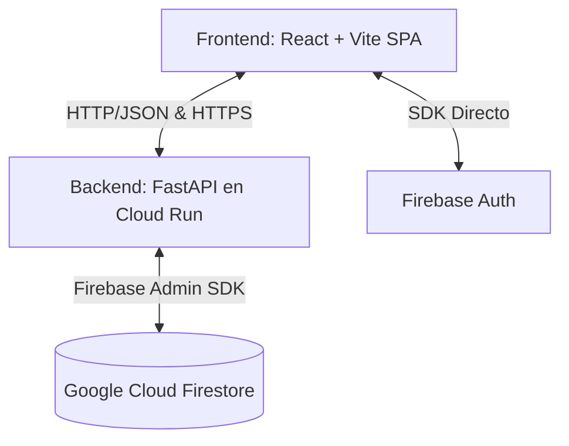

# Arquitectura del Sistema PRETSO

PRETSO (Precios del Teatro del Siglo de Oro) es una plataforma digital académica diseñada para almacenar, buscar y analizar información económica y laboral relacionada con la actividad teatral hispanoamericana de los siglos XVI y XVII.

Este documento detalla la arquitectura de software, el flujo de datos y la organización de componentes del sistema.

---

## 1. Vista General del Sistema

El sistema sigue una arquitectura desacoplada de Cliente-Servidor (Single Page Application + API REST) basada en la nube de Google Cloud y Firebase.

* **Frontend**: Una SPA moderna construida con React, TypeScript y Vite, desplegada en **Firebase Hosting**.
* **Backend**: Una API REST en Python construida con FastAPI, empaquetada con Docker y desplegada en **Google Cloud Run**.
* **Base de Datos**: Base de datos NoSQL documental **Google Cloud Firestore**.
* **Autenticación**: Proveedor de identidad gestionado por **Firebase Authentication** (integrado directamente en el cliente y validado en el backend con tokens JWT).

---

## 2. Componentes del Frontend

El frontend está estructurado en torno a rutas públicas y privadas gestionadas por React Router.

* **Páginas Públicas**:
  * **Inicio (Home)**: Muestra información del proyecto, logos de filiación institucional (THIS, Unión Europea) y el estado de preparación o progreso del lanzamiento.
  * **Buscador (Search)**: Permite a los usuarios realizar consultas avanzadas y búsquedas semánticas sobre los precios y registros publicados.
  * **Ficha de Registro (TransactionDetail)**: Vista detallada de un precio o transacción individual.
  * **Compañías**: Catálogo y búsqueda de compañías teatrales del Siglo de Oro.
* **Páginas Privadas (Administración)**:
  * **Dashboard**: Panel de control con estadísticas sobre el estado del corpus (Borradores, En Revisión, Publicados).
  * **Gestión de Registros**: Permite crear, editar y cambiar el flujo de publicación de los registros maestros.
  * **Consola ETL**: Carga masiva de archivos CSV para alimentar el corpus.

---

## 3. Componentes del Backend

El backend se divide en capas bien definidas que separan las rutas de la API, la lógica de negocio (servicios) y los esquemas de datos:

* **API Routers (`backend/src/api/`)**:
  * **`public/`**: Rutas de acceso abierto (búsquedas, compañías, anuncios, transacciones públicas).
  * **`private/`**: Rutas protegidas que requieren un token JWT de Firebase Auth válido y privilegios específicos (gestión de usuarios, auditoría, ETL, flujo de publicación).
* **Servicios (`backend/src/services/`)**:
  * **`etl_service.py`**: Parsea, valida y carga registros desde plantillas CSV a Firestore.
  * **`search_service.py`**: Provee consultas a Firestore (búsqueda de texto completo) y búsquedas semánticas utilizando representaciones vectoriales.
  * **`embedding_service.py`**: Genera embeddings vectoriales de texto mediante modelos preentrenados de Sentence-Transformers (`sentence-transformers/all-MiniLM-L6-v2`) para habilitar búsquedas conceptuales.
  * **`publication_service.py`**: Controla el ciclo de vida de los registros (Borrador -> En Revisión -> Publicado).
  * **`launch_rule.py`**: Monitorea si el corpus ha alcanzado el umbral mínimo de registros publicados para activar el acceso general de la plataforma.
* **Modelos y Esquemas (`backend/src/models/`)**:
  * Definición de entidades de datos usando **Pydantic** para la validación estricta de payloads de entrada/salida de la API REST.

---

## 4. Flujos Clave de Datos

### A. Flujo de Carga de Datos (ETL)
1. Un administrador sube un archivo CSV desde la interfaz de administración.
2. El frontend envía el archivo a `/api/v1/etl/upload`.
3. `etl_service` procesa el CSV, valida que cumpla con los esquemas de datos definidos (`RecordMaestro`) y transforma los valores monetarios a sus equivalencias en reales y maravedís.
4. Los registros validados se escriben en Firestore en estado `Borrador`.

### B. Flujo de Publicación (Flujo de Trabajo)
1. Un creador de contenido envía un registro a revisión (`Borrador` -> `En Revisión`).
2. Un usuario revisor o administrador valida el registro.
3. Al aprobarse, el registro pasa a `Publicado`.
4. El servicio de lanzamiento (`launch_rule`) detecta la publicación, actualiza los contadores globales y activa el portal si se supera el umbral configurado.

### C. Flujo de Autenticación
1. El usuario inicia sesión en el frontend usando Firebase Auth SDK.
2. Firebase devuelve un Token de ID (JWT).
3. El frontend añade este token en el header `Authorization: Bearer <token>` en cada petición al backend.
4. El backend valida el token contra Firebase Admin SDK y extrae el rol/permisos del usuario para permitir o denegar el acceso.
